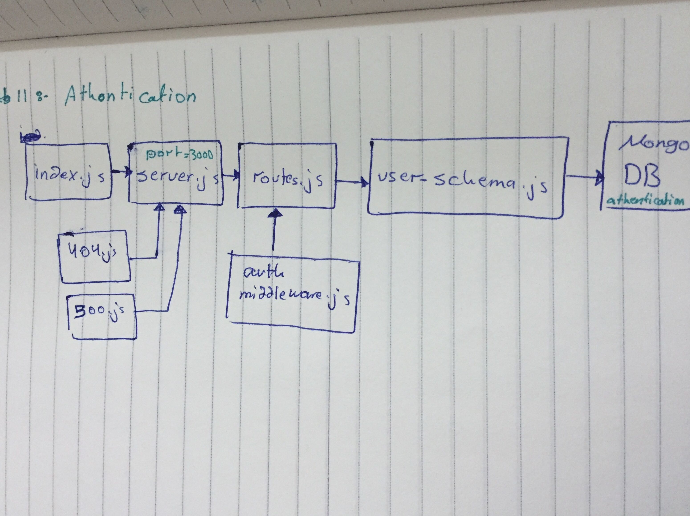

# Authentication - lab 11

Authentication
## Author: As-har Oran
## Links and Resources
* (pull request ) : [https://github.com/asharoran-401-advanced-javascript/Authentication/pull/1]
* ( action) : [https://github.com/asharoran-401-advanced-javascript/Authentication/actions]
## Setup
- npm init -y
- npm install , npm i
( "base-64" ,bcryptjs , cors ,  dotenv , jsonwebtoken , eslint , express , supertest, jest  , mordan , mongoose )
## .env requirements
- PORT - 3000
- MONGODB_URI - mongodb://localhost:27017/authentication
## How to initialize/run your server app (where applicable)
- Start App: npm start
- Endpoint: /api-docs

## Tests
Unit Tests: npm test , npm run test
Eslint: npm run lint

## UML 
* (white Board) : 